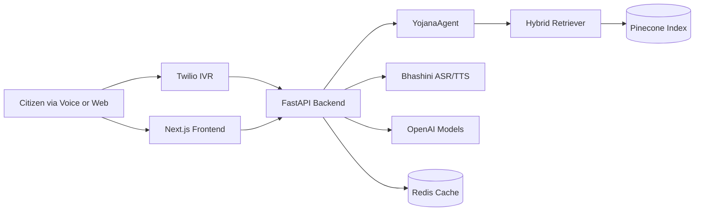

# YojanaSetu Architecture

```mermaid
flowchart LR
  Caller[Citizen via Voice or Web] --> Frontend[Next.js Frontend]
  Caller --> Twilio[Twilio IVR]
  Twilio --> Backend[FastAPI Backend]
  Frontend --> Backend
  Backend --> Agent[YojanaAgent]
  Agent --> Retriever[Hybrid Retriever]
  Retriever --> Pinecone[(Pinecone Index)]
  Backend --> Bhashini[Bhashini ASR/TTS]
  Backend --> OpenAI[OpenAI Models]
  Backend --> Redis[(Redis Cache)]
```
